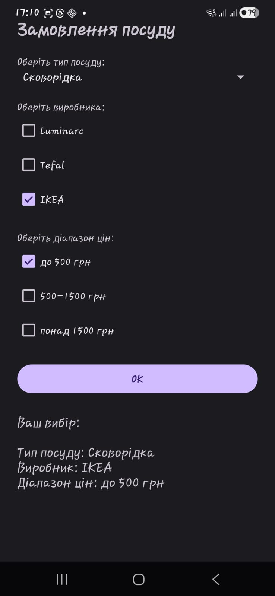
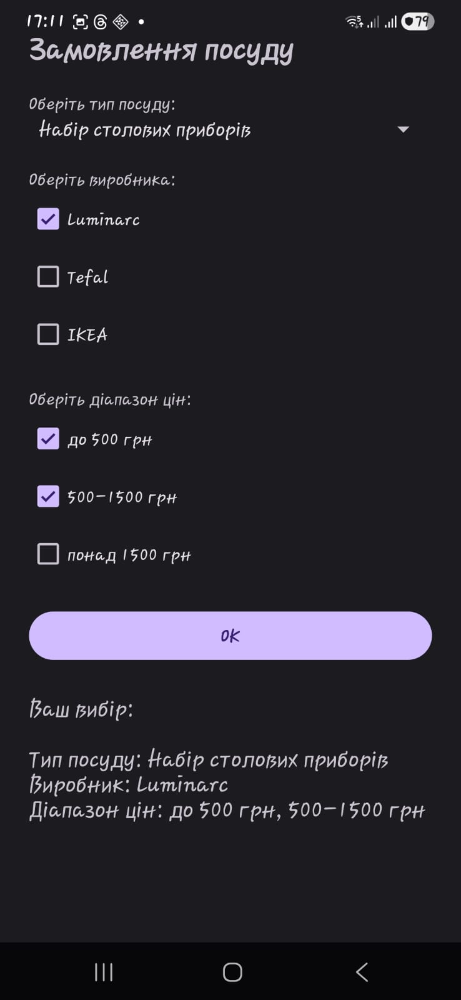
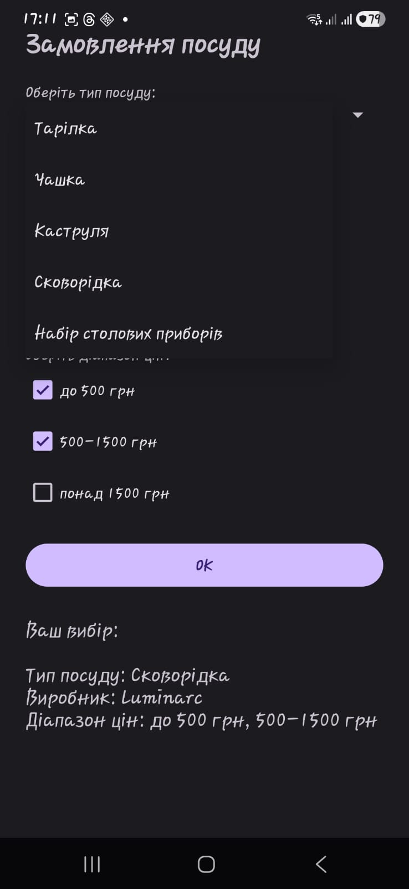
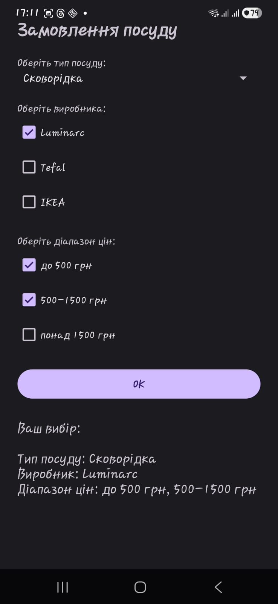
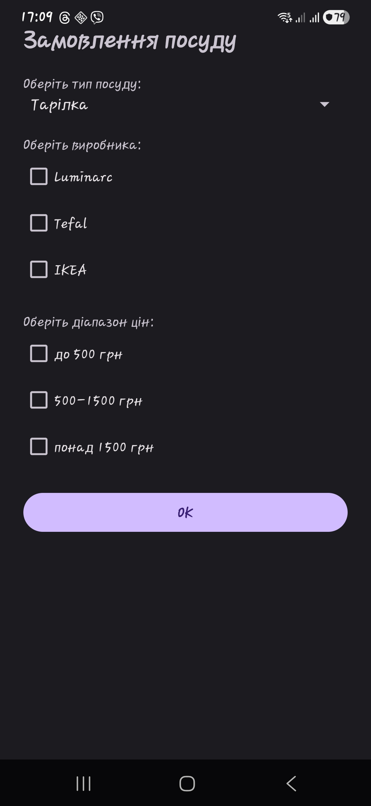

# Лабораторна робота №1

## Тема
Розробка простого Android-застосунку з використанням базових елементів інтерфейсу.

## Мета
Ознайомитися з основними компонентами Android UI та навчитися створювати простий застосунок із взаємодією користувача.

## Завдання
Розробити Android-застосунок для вибору посуду за наступними параметрами:

тип посуду (випадаючий список)
виробник (checkbox)
діапазон цін (checkbox)

Реалізувати обробку натискання кнопки та виведення результату.

## Опис виконання роботи

Було створено мобільний застосунок, який дозволяє користувачу обрати параметри посуду та отримати сформований результат.

У застосунку використано такі елементи інтерфейсу:

Spinner — для вибору типу посуду
CheckBox — для вибору виробника
CheckBox — для вибору діапазону цін
Button — для підтвердження вибору
TextView — для відображення результату
Toast — для повідомлення про помилки (якщо не обрані параметри)

Після натискання кнопки виконується перевірка:

якщо не обрано виробника або ціну — виводиться повідомлення
якщо всі параметри обрані — формується текст із результатом
## Скріншоти

## ВисновокУ ході виконання лабораторної роботи було:

вивчено базові компоненти інтерфейсу Android
реалізовано обробку подій користувача
створено повноцінний простий мобільний застосунок

Отримано практичні навички роботи з Android Studio та розробки мобільних додатків.
