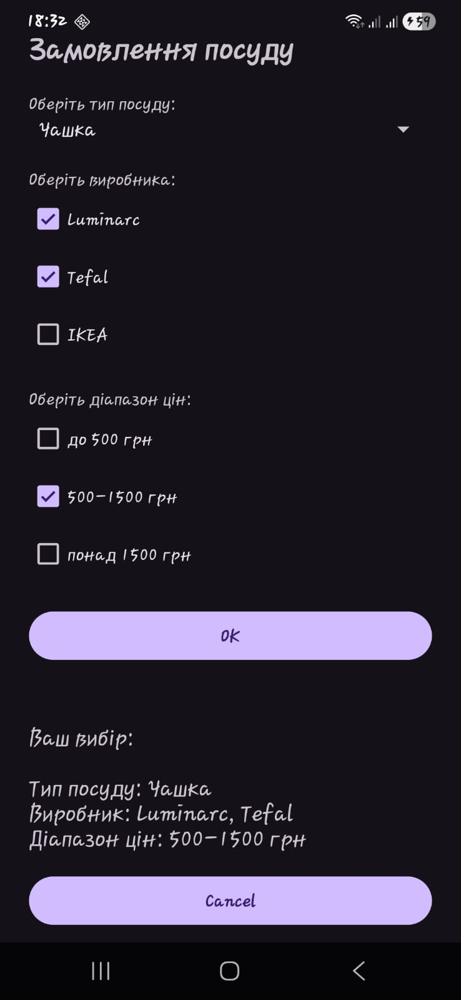
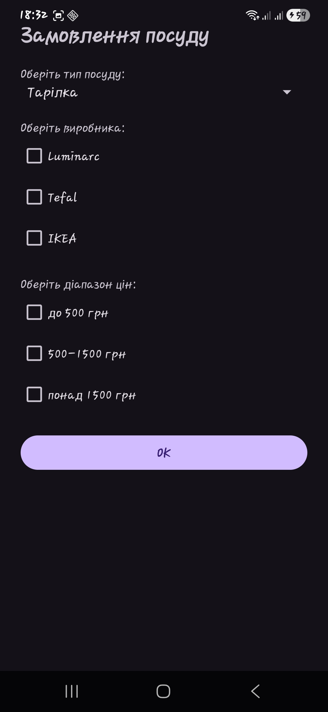

# Лабораторна робота №2

## Дисципліна: Розробка мобільних застосувань під Android

---

## Тема

Дослідження роботи з компонентом Fragment.

---

## Мета

Ознайомитися зі створенням та використанням компонентів Fragment в Android, навчитися організовувати інтерфейс користувача за допомогою декількох фрагментів та реалізовувати взаємодію між ними.

---

## Завдання

Розробити Android-застосунок, який складається з двох фрагментів:

* перший фрагмент — форма для введення даних (вибір параметрів посуду та кнопка "OK");
* другий фрагмент — відображення результату вибору та кнопка "Cancel".

Застосунок має працювати в межах однієї Activity та забезпечувати передачу даних між фрагментами.

---

## Опис виконання роботи

У ході виконання лабораторної роботи було створено застосунок, інтерфейс якого складається з двох фрагментів:

### 🔹 InputFragment

Реалізує введення даних користувачем:

* вибір типу посуду (Spinner)
* вибір виробника (CheckBox)
* вибір діапазону цін (CheckBox)
* кнопка підтвердження "OK"

Після натискання кнопки виконується перевірка введених даних. Якщо параметри обрані некоректно, відображається повідомлення (Toast). Якщо все введено правильно — формується результат та передається до Activity.

---

### ResultFragment

Відповідає за відображення результату:

* текстове поле з результатом вибору
* кнопка "Cancel"

При натисканні кнопки "Cancel":

* фрагмент результату приховується
* форма введення очищається

---

### MainActivity

Виконує роль посередника між фрагментами:

* отримує дані з InputFragment
* передає їх у ResultFragment
* керує відображенням фрагментів

---

## Взаємодія компонентів

1. Користувач вводить дані у InputFragment
2. Натискає кнопку "OK"
3. Дані передаються в MainActivity
4. Activity відкриває ResultFragment
5. Відображається результат
6. Кнопка "Cancel" видаляє ResultFragment і очищає форму

---

## Демонстрація роботи

1. Запуск застосунку
2. Відображається форма введення
3. Користувач обирає параметри
4. Натискає "OK"
5. З’являється фрагмент з результатом
6. Натискання "Cancel" очищає дані

---

## Результат роботи

---

## Висновок

У ході виконання лабораторної роботи було:

* вивчено принципи роботи компонентів Fragment
* реалізовано взаємодію між фрагментами через Activity
* створено застосунок із динамічним інтерфейсом

Отримано практичні навички роботи з модульною архітектурою інтерфейсу Android-застосунків.

---
